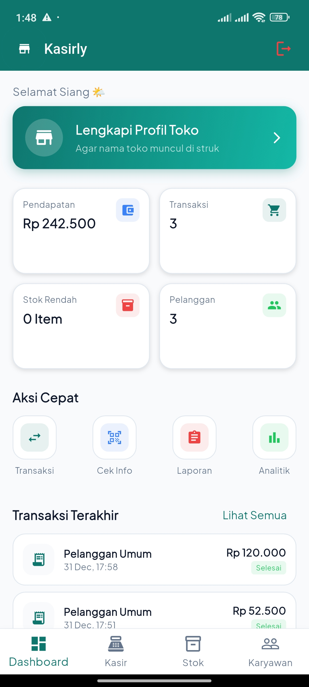

# Kasirly - Aplikasi Manajemen Toko & Stok Barang

## 👥 Identitas Pengembang
**Tim Pengembang Kasirly**

 

 
 
 

 

---

## 📲 Unduh Aplikasi
Aplikasi **Kasirly** telah tersedia dan dapat diunduh melalui Google Play Store.  
Silakan coba dan rasakan kemudahan mengelola toko dalam satu aplikasi terintegrasi.

🔗 **[Lihat di Google Play Store](https://play.google.com/store/apps/details?id=com.kasirly.id&pcampaignid=web_share)**

---

## 📄 Tentang Kasirly, Pitch Deck & Artikel
**Kasirly** adalah aplikasi *Store Management System* berbasis mobile yang dirancang sebagai solusi **All-in-One** untuk operasional toko.  
Aplikasi ini membantu pemilik usaha memantau arus barang secara *real-time*, mencegah selisih stok, mengelola transaksi kasir, serta mempermudah administrasi karyawan dalam satu platform terintegrasi.

### 📊 Pitch Deck
Presentasi lengkap mengenai latar belakang, fitur utama, arsitektur sistem, dan potensi pengembangan Kasirly dapat diakses melalui tautan berikut:

🔗 **[Lihat Pitch Deck Kasirly (PPT)](https://www.canva.com/design/DAG9EvG2d98/QUgwoHyumatYFjLKUZIwnw/edit)**

### 📝 Artikel Medium
Dokumentasi dan cerita pengembangan aplikasi Kasirly juga tersedia dalam bentuk artikel di Medium Dan Docs:

🔗 **[Baca Artikel Kasirly di Medium](https://medium.com/@aldypermana242/kasirly-empowering-micro-business-with-data-driven-decisions-899eef08c527?source=friends_link&sk=eb7d48125521bf97bd7550a960458a93)**

🔗 **[Baca Artikel Kasirly di Docs](https://docs.google.com/document/d/1dHCs9gfkxtBGxNOdK3kIggkIUtL9S0yra-IUgkF0qGU/edit?tab=t.0)**

---

# 1. Business Understanding

### Latar Belakang Masalah
Dalam operasional toko ritel, efisiensi pengelolaan stok dan transaksi adalah kunci utama. Seringkali pemilik toko menghadapi kendala dalam memantau arus keluar-masuk barang secara manual, yang menyebabkan **selisih stok (human error)**, **administrasi yang berantakan**, dan **kurangnya transparansi data**.

### Identifikasi Masalah
Proyek ini dikembangkan untuk menjawab permasalahan berikut:
1.  Kesulitan memantau arus keluar-masuk barang secara *realtime*.
2.  Resiko stok minus atau selisih barang akibat pencatatan manual.
3.  Manajemen karyawan yang belum terintegrasi dalam satu sistem.
4.  Kebutuhan akan sistem kasir (POS) yang langsung memotong stok gudang.

### Tujuan Teknis & Kriteria Sukses
* Membangun sistem **CRUD Produk** & Kategori yang *user-friendly*.
* Implementasi **Barcode Scanner** untuk input barang cepat.
* Fitur **Smart Checkout** yang memvalidasi stok sebelum transaksi.
* Penyediaan **Laporan Keuangan** transparan & sinkronisasi data *realtime*.

---

# 2. Modelling (Features & Tech)

Solusi ini dibangun menggunakan pendekatan **Mobile Application Development Life Cycle (MADLC)** dengan arsitektur MVVM.

### Fitur Unggulan (The Solution)
1.  **Inventory Control:** CRUD Produk, Kategori Custom, dan Riwayat Stok (Masuk/Keluar).
2.  **Point of Sales (POS):** Smart Checkout dengan validasi stok & Kalkulasi Otomatis.
3.  **Manajemen Karyawan:** Database pegawai, status aktif/cuti, dan kontak cepat.
4.  **Monitoring:** Dashboard Omzet, Low Stock Alert, dan Laporan Transaksi.

### Teknologi yang Digunakan
* **Framework:** Flutter (Dart)
* **Backend:** Firebase Authentication & Cloud Firestore (NoSQL)
* **Libraries Utama:** `mobile_scanner` (QR Code), `intl` (Format Rupiah), `google_fonts`.

---

# 3. Data Understanding & Preparation

### Karakteristik Data
Data disimpan menggunakan struktur NoSQL pada Cloud Firestore dengan koleksi utama:
* **Products:** Menyimpan detail barang (`name`, `stock`, `price`, `category`).
* **Employees:** Data pegawai dan status keaktifan.
* **Transactions:** Log penjualan (`timestamp`, `total_amount`, `items`).
* **History:** Rekam jejak arus barang masuk/keluar.

### Data Preparation (Logic)
Untuk memastikan data siap digunakan user, kami menerapkan:
* **Formatting:** Konversi integer ke format mata uang Rupiah (IDR).
* **Realtime Sync:** Menggunakan `StreamBuilder` agar data stok selalu *up-to-date* tanpa refresh.
* **Search Logic:** Algoritma pencarian hybrid (Teks Nama Barang & Scan Barcode).

---

## 4. Data Visualization (Screenshots)

| **Dashboard** | **Konfirmasi Pembayaran** | **Manajemen Stock Barang** | **Tim Karyawan** |
|:-------------:|:-------------------------:|:---------------------------:|:---------------:|
|  |  |  |  |
| *Dashboard Utama* | *Konfirmasi Transaksi* | *Manajemen Stok* | *Data Karyawan* |

---

<small>Made with ❤️ by Team Kasirly | UIN Sunan Gunung Djati Bandung</small>

